# 系统移植

## 汇编指令

### csrrci

#### 功能说明

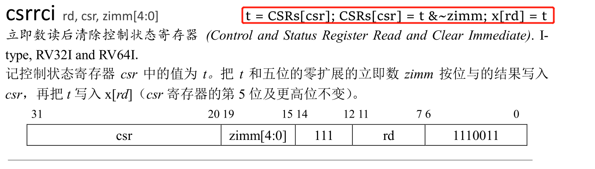

```
功能参考上图红框截图处，解释如下：
1. t = CSRs[csr] ;  		表示，获取csr寄存器的值，值使用t表示
2. CSRs[csr] = t & ~zimm ;  表示，将t和zimm取反后的值，相与，并将相与后的值，写回到csr寄存器中
3. x[rd] = t; 				表示，将t的值，写入到rd寄存器中
```

> zimm最多是5个bit长度，不长超过5bit能表示的最大长度


#### 示例说明

`csrrci a0, mstatus, 8`

上面这条指令，可以分解成如下几个动作：

- 获取mstatus寄存器的值，使用t表示
- 将t & (~8)的值（即将t的bit3清0，其余位不变），赋值给mstatus寄存器
- 将t的值赋值给a0

总结一下，示例代码，其实就是将原始的mstatus的值备份到了a0寄存器中，然后将mstatus寄存器的bit3清0

```
假如使用x[a0] 表示取a0寄存器的值，使用CSRs[mstatus]表示mstatus控制状态寄存器的值，那么，上述示例代码用C语言表示为：
t = CSRs[mstatus]			// 获取mstatus寄存器的值
CSRs[mstatus] = t & (~8)	// 将mstatus寄存器的bit3清0
x[a0] = t					// 将原始mstatus寄存器的值备份到a0寄存器中

```


### ret

#### 功能说明

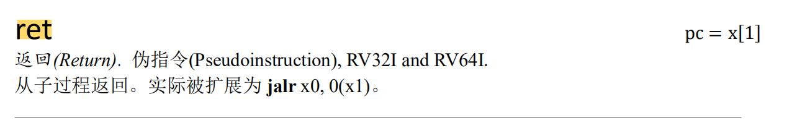

#### 示例说明
`ret`是一条伪指令，经过汇编器，编译成实际的汇编语言后，变成了一条跳转指令，比如可能为`jr ra`

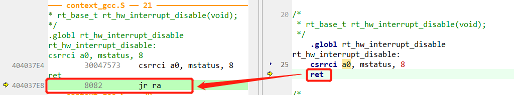


### jr

#### 功能说明

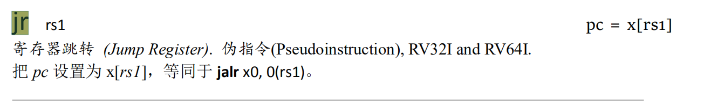


注意截图，右上部分说明 `pc = x[rs1]` ， 使用x[CPU寄存器名] 表示的含义，一般是取CPU寄存器的值，这里，就是将rs1寄存器的值，赋值给了PC 


### lw

#### 功能说明

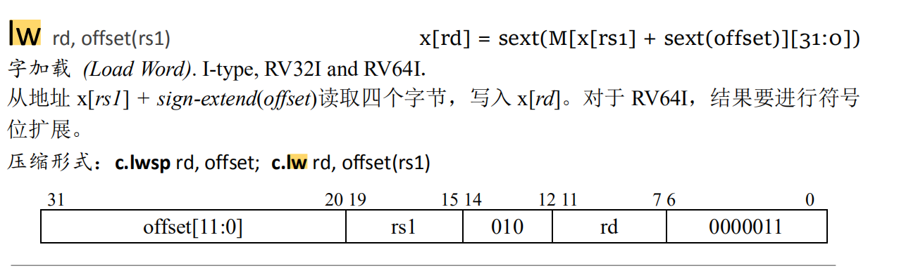

**x[rd] = *(uint32_t *)(x[rs1] + offset)**

将rs1寄存器的值，加上offset， 然后读取计算后的地址中的内容，赋值给rd寄存器

>当offset的值为0时，可以不写offset的值，即可以表示为: lw rd, (rs1)

#### 示例说明

`lw a4, 12(sp)`   将sp寄存器的值，加上12，得到另一个地址，然后将该地址内容读取出来（4字节）赋值给a4寄存器


### csrw

#### 功能说明

**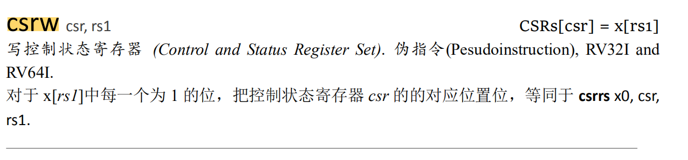**

将CPU寄存器rs1的值，赋值给csr寄存器


### j

#### 功能说明

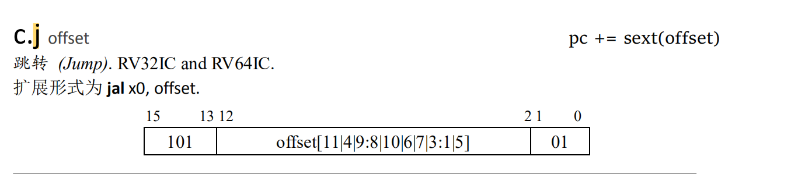

这里的offset的一个执行地址


**文档上虽然这么说，但是我这边实际测试下来，好像和文档说明的不一样**

实际测试 j offset的含义是： PC=offset， ra的值不会改变 （一般其他的跳转指令，ra的值会变化）


### csrs

#### 功能说明

用法： csrs csr, rs1

含义： CSRs[csr] |= x[rs1]

比如`csrs mstatus, a0`，执行该指令前，如果mstatus的值为0b 1100 1100, a0的值为0b 0000 0011，执行玩这条指令后，mstatus状态寄存器的值将变成0b 1100 1111


### addi

#### 功能说明

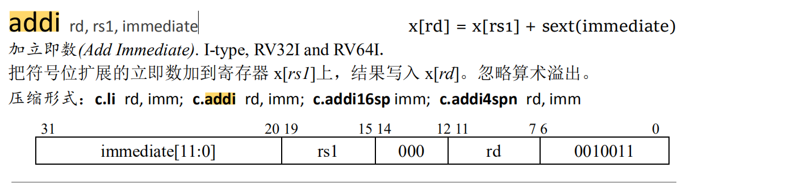


#### 示例说明

`addi sp, sp, 128` 表示sp的值，将被设置为当前sp的值，加上128


### mret

#### 功能说明

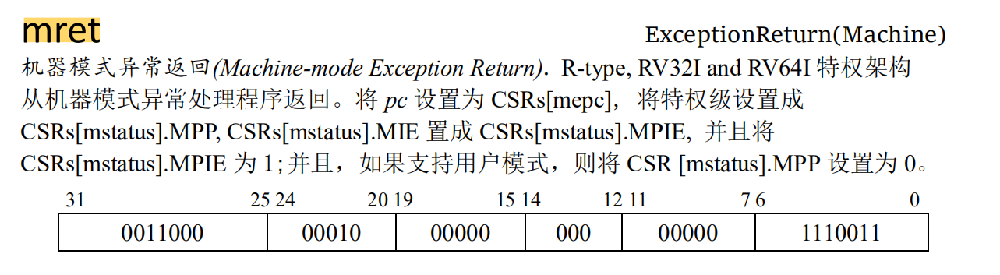

- 将PC值，设置为CSRs[mepc]
- 将特权级别设置成CSRs[mstatus].MPP
- 将CSRs[mstatus].MIE设置成CSRs[mstatus].MPIE


### li

#### 功能说明

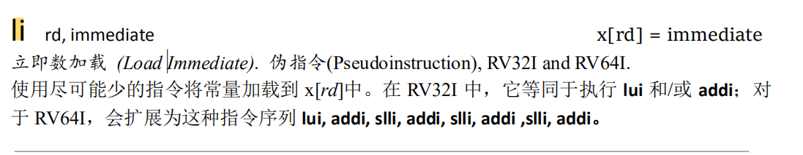


#### 示例说明

`li  t0, 0x00007800` 将t0寄存器的值，赋值为0x00007800


### sw

#### 功能说明

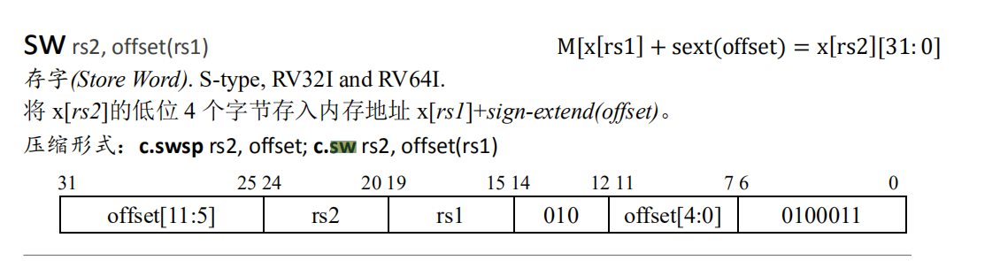


#### 示例说明

`sw sp, (a0) ` 将sp的内容，赋值给a0寄存器所指向的内存地址处


### move/mv

#### 功能说明

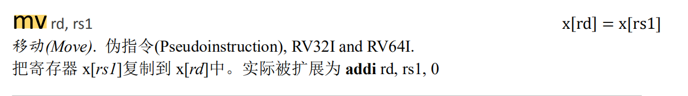

#### 示例说明

`move  s0, sp`  将sp寄存器中的值赋值给s0寄存器


### la

#### 功能说明

将symbol的地址，赋值给rd寄存器

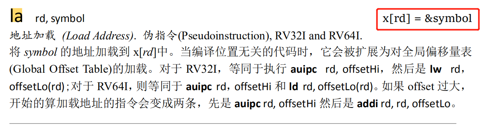

#### 示例说明

`la    sp, _sp`   将_sp的值（因为这里`_sp`就已经表示地址了，如果仅是一个变量，那么就是将变量的地址赋值给sp），赋值给sp寄存器 ，比如执行之前 `_sp`的值为0x30010000， 执行完后，`sp`的值就变成了0x30010000了


上面这一条指令会被汇编成下面两条指令：

```
auipc sp, 0xEFC0C
addi sp, sp, 1660
```

参考 auipc 汇编指令


`la    s0, rt_thread_switch_interrupt_flag`  将变量 `rt_thread_switch_interrupt_flag`  ` 的地址，赋值给s0寄存器


### auipc

#### 功能说明


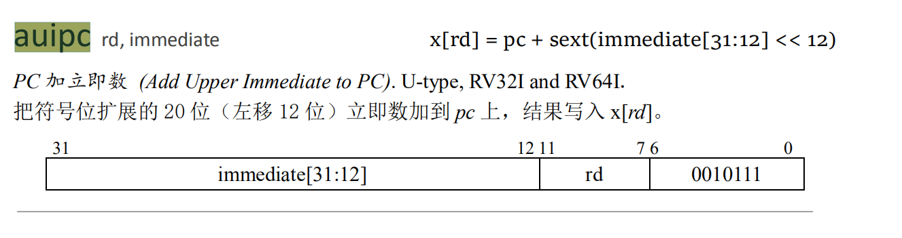

#### 示例说明

`auipc sp, 0xEFC0C` 

执行之前，寄存器的值

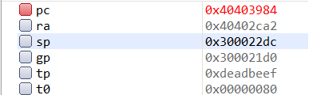


执行之后，寄存器的值

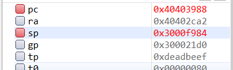


再执行：`addi sp, sp, 1660`

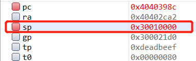


### csrrw

#### 功能说明

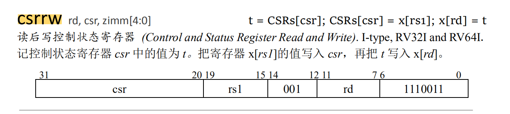


#### 示例说明

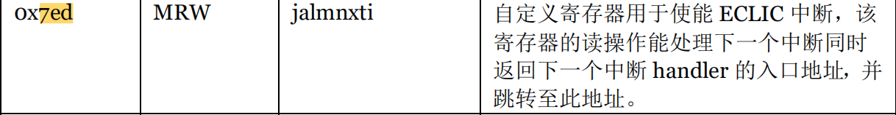

`csrrw ra, 0x07ED, ra`   # 这里的0x07ED 是某个CSR寄存器的地址，`jalmnxti` 寄存器，是bumblebee内核的自定义CSR寄存器

```
1. 读取 0x7ED CSR 寄存器中的值， 保存在临时变量 t 中
2. 读取 ra 寄存器的值，赋值给 0x7ED CSR 寄存器
3. 将第一步中读取的CSR寄存器的值 t ， 保存到 ra 寄存器中
```


### csrr

#### 示例说明

`csrr  a0, mepc` 将 mpec  CSR 寄存器的值，赋值给 CPU 的 a0 寄存器


### andi

#### 功能说明


#### 示例说明

`andi a0, a0, 8` : a0 = a0 & 8


## 系统移植

### CPU寄存器

RISC-VCPU整数寄存器有如下32个，可以使用图示名称表示，如ra, gp等，也可以使用对应的x1, x3等表示，这几种表示汇编器都认识

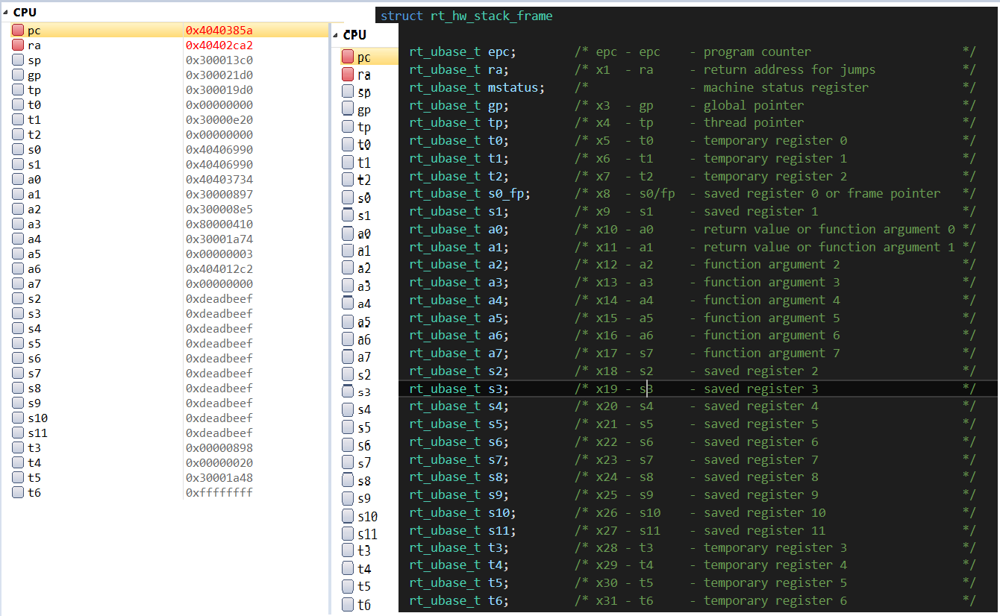

### CSR 寄存器

#### mstatus 

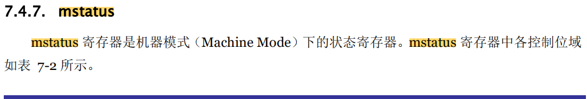

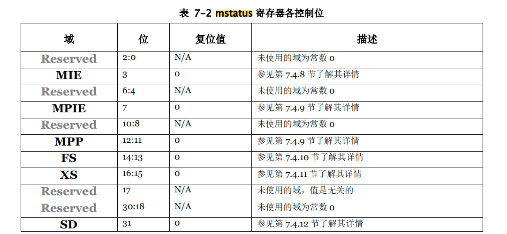


##### mstatus.MIE

MIE 位 用来表示开启关闭全局中断

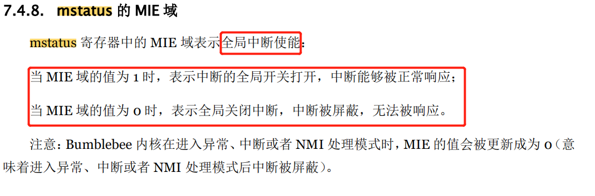

##### mstatus.MPIE 和 msatus.MPP

进入异常前，硬件自动将 mstatus.MIE


### bumble 扩展CSR寄存器

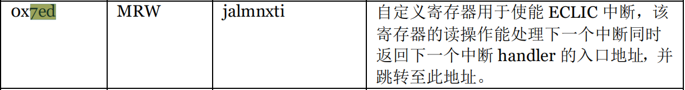

`csrrw ra, 0x07ED, ra`

